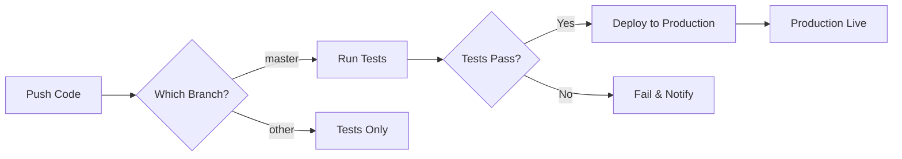

# CI/CD Setup Guide
**Food-N-Force Website - Automated Deployment Configuration**

---

## Overview

This guide walks through setting up GitHub Actions CI/CD for automated testing and deployment to Netlify.

---

## Prerequisites

1. **GitHub Repository** - Code hosted on GitHub
2. **Netlify Account** - For hosting and deployment
3. **Netlify Site Created** - Staging and Production sites set up
4. **Repository Access** - Admin access to configure secrets

---

## Step 1: Create Netlify Sites

### 1.1 Production Site
1. Log into [Netlify](https://app.netlify.com/)
2. Click **"Add new site" → "Import an existing project"**
3. Connect your GitHub repository
4. Configure build settings:
   ```
   Build command: npm run build
   Publish directory: dist
   ```
5. Click **"Deploy site"**
6. Copy the **Site ID** from Settings → General → Site details

### 1.2 Staging Site
1. Repeat the process above for staging
2. Use a different site name (e.g., `foodnforce-staging`)
3. Copy this **Site ID** as well

---

## Step 2: Get Netlify Auth Token

1. Go to [Netlify User Settings](https://app.netlify.com/user/applications)
2. Click **"New access token"**
3. Name it: `GitHub Actions CI/CD`
4. Click **"Generate token"**
5. **Copy the token immediately** (you won't see it again!)

---

## Step 3: Configure GitHub Secrets

### 3.1 Access Repository Secrets
1. Go to your GitHub repository
2. Click **Settings** → **Secrets and variables** → **Actions**
3. Click **"New repository secret"**

### 3.2 Add Required Secrets

Add these three secrets:

| Secret Name | Value | Description |
|-------------|-------|-------------|
| `NETLIFY_AUTH_TOKEN` | Your Netlify access token | Authentication for deployments |
| `NETLIFY_STAGING_SITE_ID` | Staging site ID | Target for staging deployments |
| `NETLIFY_PRODUCTION_SITE_ID` | Production site ID | Target for production deployments |

**Example:**
```
NETLIFY_AUTH_TOKEN: nfp_ABC123xyz...
NETLIFY_STAGING_SITE_ID: 12345678-abcd-1234-abcd-123456789abc
NETLIFY_PRODUCTION_SITE_ID: 87654321-dcba-4321-dcba-cba987654321
```

---

## Step 4: Enable GitHub Actions

### 4.1 Verify Workflows Exist
Check that these workflow files exist:
```
.github/workflows/
├── ci-cd.yml                 # Main CI/CD pipeline
├── dependency-update.yml     # Automated dependency updates
└── (other workflows)
```

### 4.2 Enable Workflows
1. Go to **Actions** tab in your repository
2. If workflows are disabled, click **"I understand my workflows, go ahead and enable them"**
3. Workflows will now run automatically on:
   - **Push to `master`** → Deploy to production
   - **Pull requests** → Run tests only

---

## Step 5: Configure Branch Protection

### 5.1 Protect Main Branch
1. Go to **Settings** → **Branches**
2. Click **"Add branch protection rule"**
3. Branch name pattern: `main`
4. Enable:
   - ☑️ Require a pull request before merging
   - ☑️ Require status checks to pass before merging
   - ☑️ Require branches to be up to date before merging
   - ☑️ Do not allow bypassing the above settings

### 5.2 Required Status Checks
Select these checks to be required:
- `lint`
- `test`
- `build`
- `validate`

---

## Step 6: Test the Pipeline

### 6.1 Create Test Branch
```bash
git checkout -b test/ci-cd-setup
echo "Testing CI/CD pipeline" > TEST.md
git add TEST.md
git commit -m "test: verify CI/CD pipeline"
git push origin test/ci-cd-setup
```

### 6.2 Create Pull Request
1. Go to GitHub → Pull requests → New pull request
2. Base: `master`, Compare: `test/ci-cd-setup`
3. Create pull request
4. **Verify all checks pass** ✅

### 6.3 Deploy to Production
1. Merge PR to `master` branch
2. Go to **Actions** tab
3. Watch the deployment workflow
4. Verify production site updates
5. Verify production site updates: `https://foodnforce.com`

---

## Step 7: Monitoring & Notifications

### 7.1 Slack Notifications (Optional)
1. Create Slack incoming webhook
2. Add `SLACK_WEBHOOK_URL` secret to GitHub
3. Workflow will send deployment notifications

### 7.2 Email Notifications
GitHub automatically sends email notifications for:
- Failed workflow runs
- Deployment status

Configure in: **Settings** → **Notifications**

---

## Deployment Workflow

### Automatic Deployments



### Manual Deployments

From GitHub Actions tab:
1. Click **Actions** → **CI/CD Pipeline**
2. Click **"Run workflow"**
3. Select branch
4. Choose environment (staging/production)
5. Click **"Run workflow"**

---

## Troubleshooting

### "NETLIFY_AUTH_TOKEN not found"
**Solution:** Double-check secret name matches exactly (case-sensitive)

### "Build failed: npm install timed out"
**Solution:** Check `package.json` for dependency issues, add `.npmrc` with:
```
legacy-peer-deps=true
```

### "Site ID not found"
**Solution:** Verify Netlify site exists and ID is correct

### "Tests failing in CI but pass locally"
**Solution:**
- Check Node.js version matches (use `.nvmrc` file)
- Verify all dependencies in `package.json`
- Check for environment-specific issues

### "Deployment succeeded but site broken"
**Solution:**
- Run `npm run validate:build` locally
- Check browser console for errors
- Verify environment variables set in Netlify UI

---

## CI/CD Pipeline Stages

### 1. Install
```bash
npm install
```
- Standard dependency installation
- `package-lock.json` is not tracked in git (cross-platform lockfile issues with platform-specific optional deps like esbuild/rollup)

### 2. Lint
```bash
npm run lint:html
npm run lint:css
npm run lint:js
```
- Validates HTML structure
- Checks CSS syntax
- Enforces JavaScript standards

### 3. Test
```bash
npm run test:unit          # Vitest unit tests
npm run test:accessibility # pa11y WCAG checks
npm run test:performance   # Lighthouse audits
npm run test:browser       # Playwright E2E tests
```

### 4. Build
```bash
npm run build
```
- Generates sitemap
- Compiles components
- Optimizes assets with Vite

### 5. Validate
```bash
npm run validate:build
```
- Verifies all HTML files exist
- Checks bundle sizes
- Validates asset references

### 6. Deploy
```bash
netlify deploy --prod --site=$NETLIFY_SITE_ID
```
- Uploads `dist/` to Netlify
- Activates new deployment
- Returns deploy URL

---

## Environment Variables

### Required in Netlify UI
Set these in: **Site Settings** → **Build & deploy** → **Environment variables**

#### Production
```
VITE_ENV=production
VITE_SENTRY_DSN=https://your-key@sentry.io/project
VITE_GA_MEASUREMENT_ID=G-XXXXXXXXXX
VITE_FEATURE_DEBUG_MODE=false
```

#### Staging
```
VITE_ENV=staging
VITE_SENTRY_DSN=https://your-staging-key@sentry.io/project
VITE_GA_MEASUREMENT_ID=G-STAGING-ID
VITE_FEATURE_DEBUG_MODE=true
```

---

## Performance Budgets

CI/CD will **fail** if budgets exceeded:

| Asset Type | Budget | Actual (Current) |
|------------|--------|------------------|
| CSS Bundle | 150 KB | ~92 KB ✅ |
| JS Bundle  | 200 KB | ~46 KB ✅ |
| Total Build | 2 MB  | ~1.5 MB ✅ |

Configure in: `lighthouse-budget.json`

---

## Rollback Procedures

### Automatic Rollback
If deployment fails validation, GitHub Actions automatically:
1. Deletes failed Netlify deployment
2. Reverts to previous version
3. Notifies team

### Manual Rollback
From Netlify UI:
1. Go to **Deploys** tab
2. Find last working deployment
3. Click **"..."** → **"Publish deploy"**
4. Confirm rollback

From CLI:
```bash
netlify rollback
```

---

## Best Practices

### 1. Always Use Feature Branches
```bash
git checkout -b feature/your-feature
# Make changes
git push origin feature/your-feature
# Create PR
```

### 2. Never Commit Directly to Main
- All changes via pull requests
- Require code reviews
- Enforce status checks

### 3. Test Locally Before Pushing
```bash
npm run lint
npm run test
npm run build
npm run validate:build
```

### 4. Monitor Deployments
- Check GitHub Actions after each push
- Verify staging before production
- Review Netlify deploy logs

### 5. Keep Dependencies Updated
```bash
npm run deps:check      # Check for updates
npm run deps:security   # Fix vulnerabilities
```

---

## Support

### GitHub Actions Documentation
- [Workflow syntax](https://docs.github.com/en/actions/using-workflows/workflow-syntax-for-github-actions)
- [Secrets management](https://docs.github.com/en/actions/security-guides/encrypted-secrets)

### Netlify Documentation
- [Continuous deployment](https://docs.netlify.com/configure-builds/get-started/)
- [Environment variables](https://docs.netlify.com/environment-variables/overview/)

### Internal Documentation
- `docs/project/plan.md` - Project roadmap
- `docs/current/emergency/15min-response-playbook.md` - Emergency procedures
- `PRODUCTION_READINESS_STATUS.md` - Current status

---

**Last Updated:** 2026-03-26
**Maintained By:** Technical Architect
**Next Review:** Monthly or after major infrastructure changes
