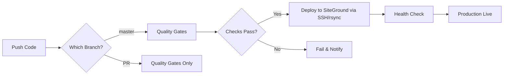

# CI/CD Setup Guide
**Food-N-Force Website - Automated Deployment Configuration**

---

## Overview

This guide walks through setting up GitHub Actions CI/CD for automated testing and deployment to SiteGround via SSH/rsync.

---

## Prerequisites

1. **GitHub Repository** - Code hosted on GitHub
2. **SiteGround Hosting Account** - With SSH access enabled
3. **SSH Key Pair** - For automated deployment authentication
4. **Repository Access** - Admin access to configure secrets

---

## Step 1: Configure SiteGround SSH Access

### 1.1 Enable SSH on SiteGround
1. Log into [SiteGround Site Tools](https://tools.siteground.com/)
2. Navigate to **Devs** → **SSH Keys Manager**
3. Generate or import an SSH key pair
4. Note the SSH connection details:
   - **Host**: Your SiteGround server hostname
   - **Port**: SSH port (typically non-standard on SiteGround)
   - **Username**: Your SSH username
   - **Web root**: `www/food-n-force.com/public_html/`

### 1.2 Test SSH Connection
```bash
ssh -p <PORT> <USERNAME>@<HOST>
```

---

## Step 2: Configure GitHub Secrets

### 2.1 Access Repository Secrets
1. Go to your GitHub repository
2. Click **Settings** → **Secrets and variables** → **Actions**
3. Click **"New repository secret"**

### 2.2 Add Required Secrets

Add these secrets:

| Secret Name | Value | Description |
|-------------|-------|-------------|
| `SITEGROUND_SSH_KEY` | SSH private key (full PEM content) | Authentication for deployment |
| `SITEGROUND_SSH_PASSPHRASE` | Key passphrase | Decrypts the SSH key |
| `SITEGROUND_HOST` | Server hostname | SiteGround server address |
| `SITEGROUND_USER` | SSH username | SiteGround login user |
| `SITEGROUND_PORT` | SSH port number | SiteGround SSH port |
| `VITE_SENTRY_DSN` | Sentry DSN URL | Error tracking (build-time) |

---

## Step 3: Enable GitHub Actions

### 3.1 Verify Workflows Exist
Check that these workflow files exist:
```
.github/workflows/
├── ci-cd.yml                 # Main CI/CD pipeline
├── weekly-a11y-sweep.yml     # Sunday full Pa11y sweep
└── jira-transition.yml       # Story workflow automation
```

Dependency updates are handled by Dependabot (`.github/dependabot.yml`).

### 3.2 Enable Workflows
1. Go to **Actions** tab in your repository
2. If workflows are disabled, click **"I understand my workflows, go ahead and enable them"**
3. Workflows will now run automatically on:
   - **Push to `master`** → Run quality checks + deploy to production
   - **Pull requests** → Run quality checks only
   - **Manual trigger** → `workflow_dispatch`

---

## Step 4: Configure Branch Protection

### 4.1 Protect Master Branch
1. Go to **Settings** → **Branches**
2. Click **"Add branch protection rule"**
3. Branch name pattern: `master`
4. Enable:
   - ☑️ Require a pull request before merging
   - ☑️ Require status checks to pass before merging
   - ☑️ Require branches to be up to date before merging
   - ☑️ Do not allow bypassing the above settings

### 4.2 Required Status Checks
Select `Quality Gates` as the required check.

---

## Step 5: Test the Pipeline

### 5.1 Create Test Branch
```bash
git checkout -b test/ci-cd-setup
echo "Testing CI/CD pipeline" > TEST.md
git add TEST.md
git commit -m "test: verify CI/CD pipeline"
git push origin test/ci-cd-setup
```

### 5.2 Create Pull Request
1. Go to GitHub → Pull requests → New pull request
2. Base: `master`, Compare: `test/ci-cd-setup`
3. Create pull request
4. **Verify quality checks pass**

### 5.3 Deploy to Production
1. Merge PR to `master` branch
2. Go to **Actions** tab
3. Watch the deployment workflow
4. Verify production site: `https://food-n-force.com`

---

## Step 6: Monitoring & Notifications

### 6.1 Email Notifications
GitHub automatically sends email notifications for:
- Failed workflow runs
- Deployment status

Configure in: **Settings** → **Notifications**

---

## Deployment Workflow

### Automatic Deployments



### Manual Deployments

From GitHub Actions tab:
1. Click **Actions** → **Food-N-Force CI/CD Pipeline**
2. Click **"Run workflow"**
3. Select branch
4. Click **"Run workflow"**

---

## CI/CD Pipeline Stages

The pipeline runs as two jobs: `quality-checks` and `deploy`.

### Job 1: Quality Gates

#### 1. Install
```bash
npm install
```
- Standard dependency installation
- `package-lock.json` is not tracked in git (cross-platform lockfile issues with platform-specific optional deps like esbuild/rollup)

#### 2. Validate HTML
```bash
npm run validate:html
```
- W3C HTML validation via html-validate

#### 3. Lint
```bash
npm run lint:css
npm run lint:js
```
- Checks CSS syntax via Stylelint
- Enforces JavaScript standards via ESLint

#### 4. Unit Tests
```bash
npm run test:unit
```
- Runs Vitest unit test suite (159 tests)

#### 5. Build
```bash
npm run build
```
- Generates sitemap
- Compiles components
- Optimizes assets with Vite (tree-shaking, Terser minification)

#### 6. Accessibility Tests
```bash
npm run test:accessibility
```
- Pa11y WCAG 2.1 AA compliance checks
- Runs against preview server
- `continue-on-error: true` (non-blocking)

**Note**: Performance tests (`test:performance`) and browser tests (`test:browser`) are available locally but are not run in CI to keep pipeline fast.

### Job 2: Deploy (master branch only)

#### 7. Deploy via SSH
```bash
rsync -avz --delete -e "ssh -p $SSH_PORT" dist/ ${SSH_USER}@${SSH_HOST}:www/food-n-force.com/public_html/
```
- Downloads build artifact from quality-checks job
- Deploys `dist/` to SiteGround via rsync over SSH
- Flushes SiteGround caches (file touch + Memcached)

#### 8. Health Check
```bash
curl -s -o /dev/null -w "%{http_code}" https://food-n-force.com
```
- Verifies site returns HTTP 200 after deployment

---

## Environment Variables

### Required in GitHub Secrets
Set in: **GitHub → Settings → Secrets and variables → Actions**

#### Build-Time Variables
```
VITE_SENTRY_DSN=https://your-key@sentry.io/project
```

#### Deployment Credentials
```
SITEGROUND_SSH_KEY=(SSH private key)
SITEGROUND_SSH_PASSPHRASE=(key passphrase)
SITEGROUND_HOST=(server hostname)
SITEGROUND_USER=(SSH username)
SITEGROUND_PORT=(SSH port)
```

---

## Performance Budgets

| Asset Type | Budget | Actual (Current) |
|------------|--------|------------------|
| CSS Bundle | 150 KB | ~92 KB |
| JS Bundle  | 200 KB | ~46 KB |
| Total Build | 2 MB  | ~1.5 MB |

Configure in: `lighthouse-budget.json` and `lighthouse.config.js`

---

## Rollback Procedures

### Quick Rollback via Git
```bash
# Revert the last commit and push — triggers a new deployment
git revert HEAD
git push origin master
```

### Restore Point System
```bash
# Create a restore point before risky changes
npm run restore:create

# Apply a previous restore point
npm run restore:apply
```

### Manual Re-deployment
From GitHub Actions:
1. Go to **Actions** → find the last successful workflow run
2. Click **"Re-run all jobs"** to redeploy that version

---

## Troubleshooting

### "SSH connection refused"
**Solution:** Verify SiteGround SSH is enabled and the port number is correct in GitHub secrets

### "Permission denied (publickey)"
**Solution:** Ensure `SITEGROUND_SSH_KEY` contains the full private key (including `-----BEGIN/END-----` lines) and `SITEGROUND_SSH_PASSPHRASE` is correct

### "Build failed: npm install timed out"
**Solution:** Check `package.json` for dependency issues

### "Tests failing in CI but pass locally"
**Solution:**
- CI uses Node.js 22 — ensure local version matches
- Verify all dependencies in `package.json`
- Check for environment-specific issues

### "Deployment succeeded but site broken"
**Solution:**
- Run `npm run validate:build` locally
- Check browser console for errors
- SSH into SiteGround to verify files were deployed correctly

---

## Best Practices

### 1. Always Use Feature Branches
```bash
git checkout -b feature/your-feature
# Make changes
git push origin feature/your-feature
# Create PR
```

### 2. Never Commit Directly to Master
- All changes via pull requests
- Require code reviews
- Enforce status checks

### 3. Test Locally Before Pushing
```bash
npm run lint
npm run test
npm run build
npm run validate:build
```

### 4. Monitor Deployments
- Check GitHub Actions after each push
- Verify site at `https://food-n-force.com` after deploy
- Review health check output in workflow logs

### 5. Keep Dependencies Updated
```bash
npm run deps:check      # Check for updates
npm run deps:security   # Fix vulnerabilities
```

---

## Support

### GitHub Actions Documentation
- [Workflow syntax](https://docs.github.com/en/actions/using-workflows/workflow-syntax-for-github-actions)
- [Secrets management](https://docs.github.com/en/actions/security-guides/encrypted-secrets)

### Internal Documentation
- `docs/project/plan.md` - Project roadmap
- `docs/current/emergency/15min-response-playbook.md` - Emergency procedures
- `docs/ENVIRONMENT.md` - Environment variable configuration

---

**Last Updated:** 2026-03-26
**Maintained By:** Technical Architect
**Next Review:** Monthly or after major infrastructure changes
