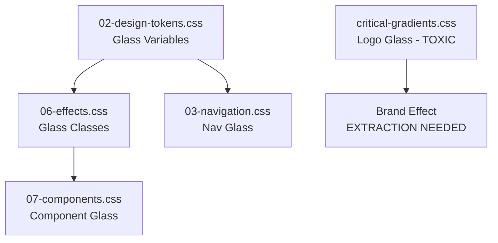

# Glassmorphism Effects Protection Strategy

**Date**: 2025-09-25
**Status**: Critical Protection Protocol
**Priority**: P0 - Visual Effects Must Be Preserved During CSS Deconfliction

## Executive Summary

The Food-N-Force website's premium glassmorphism effects are distributed across multiple CSS files and at risk during the cascade deconfliction process. This strategy identifies all glassmorphism dependencies, defines protection zones, and establishes validation protocols to ensure pixel-perfect preservation during the 102.67 KB CSS bundle reduction.

## Glassmorphism Effect Inventory

### Primary Glass Effects (06-effects.css - PROTECTED ZONE)

#### Core Glass System Variables
```css
/* DO NOT MODIFY - Primary design tokens */
:root {
    --glass-bg-primary: rgba(45,55,65,.55);    /* Primary glass background */
    --glass-bg-secondary: rgba(22,50,92,.85);  /* Stronger glass background */
    --glass-blur: blur(10px);                  /* Backdrop blur amount */
    --glass-border: rgba(100,120,140,.3);      /* Glass border color */
}
```

#### Master Glass Classes
```css
/* PROTECTED - Core glassmorphism implementation */
.fnf-glass {
    background: var(--glass-bg-primary);
    backdrop-filter: var(--glass-blur);
    border: 1px solid var(--glass-border);
    border-radius: var(--slds-border-radius-large);
    box-shadow: var(--slds-shadow-large);
}

.fnf-glass--strong {
    background: var(--glass-bg-secondary);
    box-shadow: var(--slds-shadow-x-large);
}
```

#### Accessibility & Browser Fallbacks
```css
/* PROTECTED - High contrast mode fallbacks */
@media (prefers-contrast:high) {
    .fnf-glass {
        background: rgba(0,0,0,.9);
        border: 2px solid #fff;
    }
    .fnf-glass--strong {
        background: rgba(0,0,0,.95);
    }
}
```

### Navigation Glass Effects (03-navigation.css - PROTECTED ZONE)

#### Navigation Backdrop System
```css
/* CRITICAL - Main navigation glass effect */
.fnf-nav {
    background: linear-gradient(135deg, var(--fnf-gradient-start) 0%, var(--fnf-gradient-end) 100%);
    backdrop-filter: var(--glass-blur);
    box-shadow: var(--slds-shadow-medium);
}

/* CRITICAL - Mobile navigation glass overlay */
.fnf-nav__mobile {
    background: var(--glass-bg-secondary);
    backdrop-filter: var(--glass-blur);
    box-shadow: var(--slds-shadow-large);
}
```

### Component Glass Effects (07-components.css - MODERATE RISK)

#### Card System Glass Implementation
```css
/* PROTECTED - Component cards with glassmorphism */
.fnf-focus-card, .fnf-service-card, .fnf-resource-card,
.fnf-expertise-card, .fnf-value-card, .fnf-measurable-card,
.focus-area-card, .measurable-card, .service-card,
.resource-card, .expertise-card, .value-card,
.testimonial-card, .impact-card {
    background: rgba(45,55,65,.6) !important;
    backdrop-filter: blur(10px) !important;
    border: 1px solid rgba(100,120,140,.3) !important;
    box-shadow: 0 8px 32px rgba(0,0,0,.3) !important;
}

.fnf-stat-card {
    background: var(--glass-bg-primary);
    backdrop-filter: var(--glass-blur);
    border: 1px solid var(--glass-border);
}

.fnf-testimonial-card {
    background: var(--glass-bg-primary);
    backdrop-filter: var(--glass-blur);
    border: 1px solid var(--glass-border);
}
```

#### Form Elements Glass Effects
```css
/* PROTECTED - Glass form inputs */
.fnf-input, .fnf-textarea {
    background: rgba(255,255,255,.1);
    backdrop-filter: var(--glass-blur);
    border: 1px solid var(--glass-border);
}

.fnf-contact-form-container, .fnf-contact-info-container {
    backdrop-filter: var(--glass-blur);
    border: 1px solid var(--glass-border);
}
```

### Logo Brand Glass Effects (TOXIC FILE EXTRACTION REQUIRED)

Located in critical-gradients.css (CONTAMINATED):
```css
/* MUST BE EXTRACTED AND PROTECTED */
.fnf-nav__brand::after {
    background: rgba(1,31,63,0.55) !important;
    backdrop-filter: blur(8px) saturate(120%) !important;
}
```

## Risk Assessment by File

### HIGH RISK: critical-gradients.css (91.41 KB)
**Status**: TOXIC - Contains protected glass effects buried in cascade warfare
**Risk**: Logo brand glassmorphism effect may be lost during detoxification
**Mitigation**: Extract protected effects BEFORE bulk removal

```css
/* CRITICAL EXTRACTION TARGET */
.fnf-nav__brand::after {
    backdrop-filter: blur(8px) saturate(120%) !important;
    background: rgba(1,31,63,0.55) !important;
    box-shadow: inset 0 0 15px rgba(0,0,0,0.35), 0 0 0 1px rgba(255,255,255,0.12) !important;
}
```

### MEDIUM RISK: 07-components.css (15.24 KB)
**Status**: Contains multiple glassmorphism implementations with inline RGBA values
**Risk**: Hard-coded RGBA values may not consolidate cleanly with design tokens
**Mitigation**: Convert hard-coded values to design tokens during consolidation

### LOW RISK: 03-navigation.css (7.19 KB)
**Status**: Clean glassmorphism implementation using design tokens
**Risk**: Minimal - well-architected and uses proper CSS custom properties

### PROTECTED: 06-effects.css (7.79 KB)
**Status**: Master glassmorphism definitions - DO NOT MODIFY
**Risk**: Zero - This is the source of truth for all glass effects

## Glass Effect Dependencies Map

### Dependency Chain


### Variable Dependency Matrix
| Variable | Source File | Usage Files | Risk Level |
|----------|-------------|-------------|-------------|
| `--glass-bg-primary` | 02-design-tokens.css | 06-effects.css, 07-components.css | LOW |
| `--glass-bg-secondary` | 02-design-tokens.css | 06-effects.css, 03-navigation.css | LOW |
| `--glass-blur` | 02-design-tokens.css | ALL glass files | LOW |
| `--glass-border` | 02-design-tokens.css | ALL glass files | LOW |
| `rgba(45,55,65,.6)` | 07-components.css | Hard-coded in component cards | MEDIUM |
| `rgba(1,31,63,0.55)` | critical-gradients.css | Logo brand effect | HIGH |

## Protection Protocol During Deconfliction

### Phase 1: Pre-Deconfliction Protection (Day 1)
```bash
# 1. Extract protected logo glass effect from critical-gradients.css
grep -A 5 -B 5 "backdrop-filter.*blur" src/css/critical-gradients.css > logo-glass-extraction.css

# 2. Validate glass variable definitions
grep -r "--glass-" src/css/ | sort | uniq

# 3. Create glass effect baseline screenshots
npm run test:glassmorphism-baseline
```

### Phase 2: Real-Time Validation (During Each Change)
```bash
# Automated glass effect testing
function validate_glassmorphism() {
    # Check backdrop-filter support
    echo "Validating backdrop-filter support..."

    # Screenshot comparison for glass elements
    npx playwright test --grep "glassmorphism" --reporter=html

    # CSS property validation
    node -e "
    const fs = require('fs');
    const css = fs.readFileSync('src/css/main.css', 'utf8');
    const glassProps = css.match(/backdrop-filter|rgba\([^)]+0\.\d+\)|blur\(\d+px\)/g);
    console.log('Glass properties found:', glassProps?.length || 0);
    "
}
```

### Phase 3: Visual Regression Detection
```javascript
// Automated glassmorphism testing
const glassElements = [
    '.fnf-nav',
    '.fnf-nav__mobile',
    '.fnf-glass',
    '.fnf-stat-card',
    '.fnf-testimonial-card',
    '.fnf-nav__brand::after',
    '.focus-area-card',
    '.service-card',
    '.resource-card'
];

// Test each element for backdrop-filter support
glassElements.forEach(selector => {
    const element = document.querySelector(selector);
    if (element) {
        const styles = getComputedStyle(element);
        const hasBackdropFilter = styles.backdropFilter !== 'none';
        console.log(`${selector}: backdrop-filter ${hasBackdropFilter ? '✓' : '✗'}`);
    }
});
```

## Browser Compatibility Safeguards

### Backdrop-Filter Support Matrix
- **Chrome/Edge**: Full support (backdrop-filter + webkit-backdrop-filter)
- **Firefox**: Full support (backdrop-filter)
- **Safari**: Requires -webkit-backdrop-filter prefix
- **Mobile**: iOS Safari and Chrome Android supported

### Fallback Strategy
```css
/* PROTECTED - Progressive enhancement for glass effects */
.fnf-glass {
    /* Fallback for browsers without backdrop-filter */
    background: rgba(45,55,65,.85);

    /* Modern browsers with backdrop-filter support */
    @supports (backdrop-filter: blur(10px)) {
        background: var(--glass-bg-primary);
        backdrop-filter: var(--glass-blur);
    }

    /* Safari webkit prefix fallback */
    @supports (-webkit-backdrop-filter: blur(10px)) {
        -webkit-backdrop-filter: var(--glass-blur);
    }
}
```

## Consolidation Safe Zones

### SAFE TO CONSOLIDATE
1. **Hard-coded RGBA values** → Convert to CSS custom properties:
   ```css
   /* BEFORE: Hard-coded in 07-components.css */
   background: rgba(45,55,65,.6) !important;

   /* AFTER: Use design token */
   background: var(--glass-bg-card);
   ```

2. **Duplicate glass borders** → Standardize to design token:
   ```css
   /* BEFORE: Multiple variations */
   border: 1px solid rgba(100,120,140,.3) !important;
   border: 1px solid rgba(100,120,140,.4);

   /* AFTER: Single source of truth */
   border: 1px solid var(--glass-border);
   ```

### UNSAFE TO CONSOLIDATE (PROTECTED)
1. **06-effects.css master definitions** - Source of truth for all glass effects
2. **Navigation backdrop filters** - Critical for navigation glass appearance
3. **Logo brand glassmorphism** - Unique premium effect requiring extraction from toxic file
4. **Accessibility fallbacks** - High contrast mode alternatives

## Validation Checkpoints

### Checkpoint 1: Variable Consolidation (Day 2)
- [ ] All glass variables defined once in 02-design-tokens.css
- [ ] Zero duplicate glass variable definitions
- [ ] All glass effects render identically
- [ ] Backdrop-filter support maintained across browsers

### Checkpoint 2: Component Consolidation (Day 5)
- [ ] Hard-coded RGBA values converted to design tokens
- [ ] Component cards maintain glassmorphism appearance
- [ ] Form elements retain glass styling
- [ ] No visual regressions in card hover effects

### Checkpoint 3: Toxic File Detoxification (Day 8)
- [ ] Logo brand glass effect successfully extracted and preserved
- [ ] Navigation glassmorphism unaffected by critical-gradients.css cleanup
- [ ] All premium effects operational across all pages
- [ ] Bundle size reduced without glass effect degradation

### Checkpoint 4: Final Validation (Day 12)
- [ ] All glassmorphism effects pixel-perfect compared to baseline
- [ ] Cross-browser glass effect consistency verified
- [ ] Accessibility fallbacks functional
- [ ] Performance impact of backdrop-filter effects acceptable

## Emergency Rollback Triggers for Glass Effects

### Immediate Rollback Required If:
1. **Visual Degradation**: Any glass effect appears flat or loses transparency
2. **Backdrop-Filter Loss**: Elements missing blur or saturation effects
3. **Browser Inconsistency**: Glass effects render differently across Chrome/Firefox/Safari
4. **Accessibility Failure**: High contrast mode fallbacks not working
5. **Logo Brand Effect Loss**: Premium spinning logo loses glassmorphism

### Glass Effect Monitoring Script
```bash
#!/bin/bash
# Glass effect health check
echo "🔍 Checking glassmorphism effects..."

# Check for backdrop-filter properties
BACKDROP_COUNT=$(grep -r "backdrop-filter" src/css/ | wc -l)
echo "Backdrop-filter instances: $BACKDROP_COUNT"

# Check for glass variables
GLASS_VAR_COUNT=$(grep -r "--glass-" src/css/ | wc -l)
echo "Glass variables: $GLASS_VAR_COUNT"

# Validate glass classes exist
GLASS_CLASS_COUNT=$(grep -r "\.fnf-glass" src/css/ | wc -l)
echo "Glass classes: $GLASS_CLASS_COUNT"

if [ $BACKDROP_COUNT -lt 8 ] || [ $GLASS_VAR_COUNT -lt 16 ] || [ $GLASS_CLASS_COUNT -lt 4 ]; then
    echo "🚨 GLASS EFFECT DEGRADATION DETECTED - ROLLBACK RECOMMENDED"
    exit 1
else
    echo "✅ Glass effects healthy"
fi
```

## Success Metrics for Glass Effect Preservation

### Quantitative Metrics
- **Backdrop-filter count**: Minimum 8 instances across all files
- **Glass variable count**: Exactly 4 core variables (bg-primary, bg-secondary, blur, border)
- **Glass class count**: Minimum 4 core classes (.fnf-glass, .fnf-glass--strong, etc.)
- **Visual regression tolerance**: 0% - Glass effects must be pixel-perfect

### Qualitative Validation
- Navigation maintains semi-transparent frosted glass appearance
- Cards display subtle transparency with background blur
- Logo brand effect retains premium frosted backdrop
- Form elements show glass-like input styling
- Mobile navigation overlay preserves glass aesthetic

This protection strategy ensures that the 102.67 KB CSS bundle reduction preserves all premium glassmorphism effects while enabling successful cascade deconfliction.